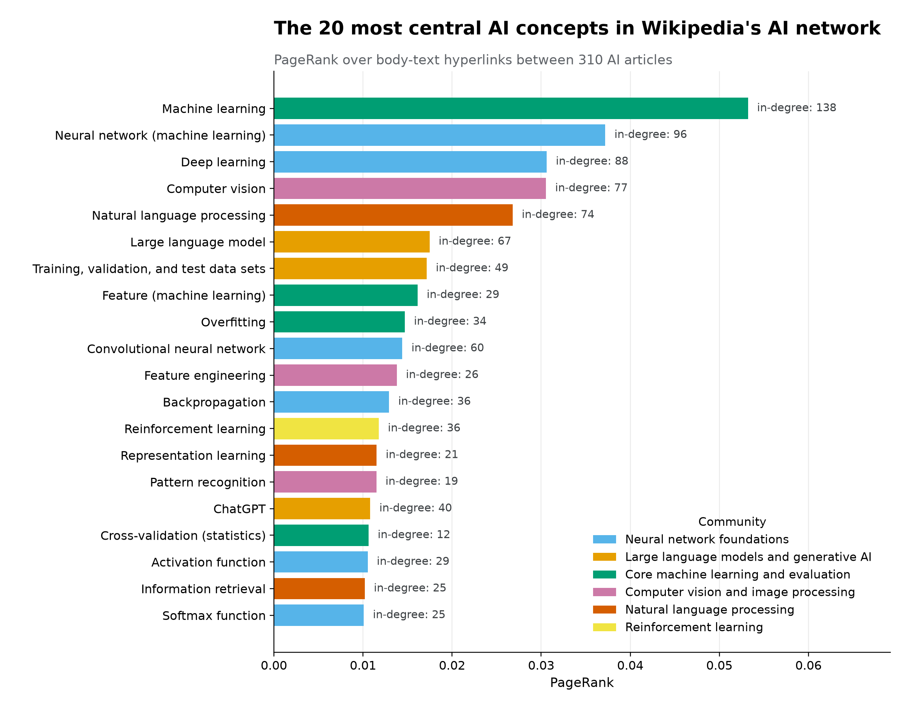
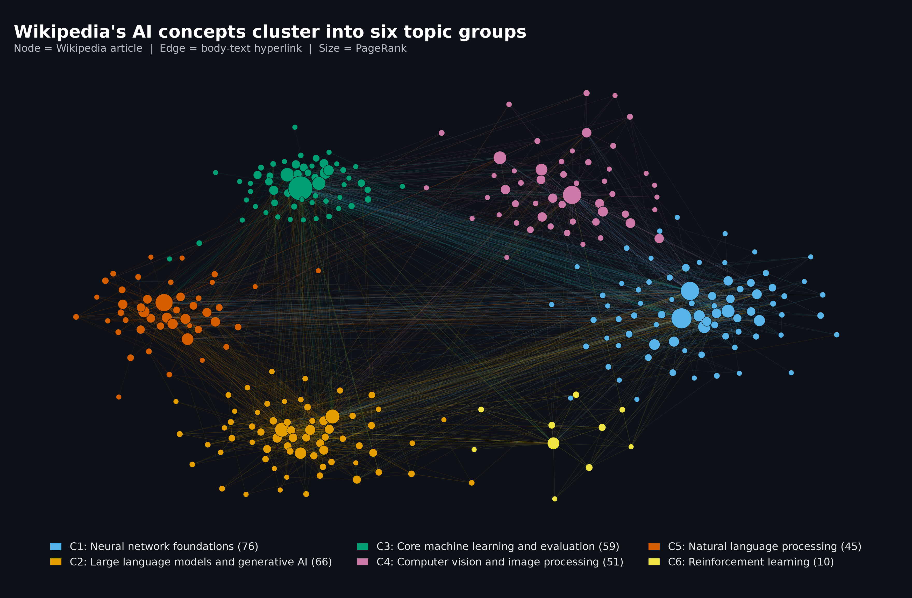

# Mapping AI Through Wikipedia: Which Concepts Are Most Central?

### Introduction

The question I want to answer is: Which AI concepts are most central to Wikipedia’s coverage of artificial intelligence, and how do they group into topics?

Artificial intelligence has grown into a broad and fast-moving field, and many people now learn about it through online content rather than formal courses. YouTube channels, blogs, newsletters, and short-form videos explain everything from classic machine learning and neural networks to large language models, computer vision, AI agents and the ethics of deploying AI systems. Many of these concepts depend on one another. It is difficult to explain transformers without first covering neural networks, or reinforcement learning without some grounding in how agents learn from feedback and a creator building an educational series has to decide which ideas to cover first and how to group the rest into a coherent sequence, and with limited production time, those choices matter.

Wikipedia is one of the most widely used reference sources on the web, and its articles on AI are written and maintained by a large community of volunteer editors. When editors explain a concept, they link to other articles that provide related information or additional context. Together, these hyperlinks form a web graph which is a network of articles connected by the references editors chose to include. The link structure then shows how AI concepts are connected to one another across Wikipedia’s coverage of the field.

The primary stakeholder for this analysis is a tech content creator and educator planning an educational series on AI. The answer to my question will inform two decisions. Which concepts to cover early in the series and how to organize episodes or posts into themed segments.

The data used in this analysis comes from English Wikipedia articles in AI and machine-learning categories, which I collected through the MediaWiki API. Each article is represented as a node, and a directed edge is created when one article’s body text links to another article in the network. This network structure provides information that page views or article length cannot. If many AI articles link to the same article when explaining their own topics, that concept acts as a common reference point for the rest of the field. PageRank extends this idea by giving more weight to links coming from articles that are themselves important.

The network can also reveal groups of articles that link heavily to one another, which can suggest natural segments for an educational series. Articles that connect otherwise separate groups can then serve as transition topics between those segments.

Hyperlinks reflect editors’ decisions, not audience demand or verified learning prerequisites, so these results are a starting point. A content creator should combine the insights from this network analysis with audience analytics, their domain knowledge, viewer experience level, and their own expertise to plan their content ideas.

### Building the Wikipedia AI network

I collected articles using the MediaWiki API with Python’s requests library and used BeautifulSoup to extract hyperlinks from the body of each article.

I started with eight Wikipedia categories covering major areas of AI:

- Machine learning
- Deep learning
- Artificial neural networks
- Natural language processing
- Reinforcement learning
- Computer vision
- Large language models
- AI safety

The categories initially produced 948 unique articles. However, not everything inside a Wikipedia category represents the type of AI concept I wanted to analyze. The data included lists, biographies, organizations, redirects, and many very short or narrowly focused articles.

I removed lists and outlines, people, organizations, duplicate redirects, and articles shorter than 15,000 bytes. I used 15,000 bytes as a practical scope threshold to focus the analysis on more developed articles while keeping the network at a manageable size for this analysis. The threshold is not meant to imply that shorter articles are unimportant.

After cleaning, the final network contained 310 articles.

For each article, I collected information such as its title, Wikipedia category, article length, and its links to other articles in the network. I also excluded navigation boxes, info boxes, references, and other page elements so that the edges represented links editors actually placed within the article content.

The resulting network contained 2,369 unique directed edges. Of those, 2,096 came from ordinary body content and 273 came from “See also” sections.

The final graph will then be used to answer the research question of: “When Wikipedia explains one AI concept, which other AI concepts does it point readers toward?”

### What does “important” mean in this network?

There are different ways to define importance in a network.

The simplest measure I used is in-degree, which counts how many other articles link to a particular article. If 100 AI articles link to “Machine learning,” its in-degree is 100.

However, not every link necessarily carries the same information. A link from an article that is itself highly connected may tell us more about the structure of the network than a link from an isolated article.

Because of that, my primary measure of importance is PageRank.

PageRank considers both the number of links an article receives and the importance of the articles providing those links. A concept receives a higher score when it is referenced by other concepts that are themselves central to the network.

I used PageRank as the primary ranking and in-degree as a second measure to check whether both measures told a similar story and they did with 17 of the top 20 articles by PageRank also being among the top 20 by in-degree. That overlap gave me more confidence that the highest-ranked articles really are common reference points in Wikipedia’s AI network.

### Which AI concepts are the most central?

The five highest-ranked concepts were:

1. Machine learning
2. Neural network
3. Deep learning
4. Computer vision
5. Natural language processing

Machine learning stood out by a fairly large margin. It had a PageRank score of approximately 0.053 and received links from 138 other articles in the network.

Neural networks followed with 96 incoming links, deep learning with 88, computer vision with 77, and natural language processing with 74.

Large language models ranked sixth with 67 incoming links.

The 20 most central AI concepts by PageRank. Machine learning is the strongest central reference point, followed by neural networks, deep learning, computer vision, and natural language processing.

These rankings make sense when looking at the role these concepts play across AI.

“Machine learning” is an umbrella concept that appears throughout discussions of neural networks, computer vision, language models, evaluation techniques, reinforcement learning, and many other areas. Neural networks and deep learning similarly provide context for many of the systems discussed in more specialized articles.

The result does not mean someone must learn these five concepts in this exact order.

Instead, it shows that Wikipedia repeatedly uses them as reference points when explaining other parts of AI.

For a content creator, that distinction matters as these concepts are good candidates for early content because explaining them creates context that can be reused when covering more specialized topics later.

### Distinct communities in the AI network

Ranking individual concepts only answers half of the question.

I also wanted to understand how the articles group together.

To do this, I used the Louvain community-detection algorithm. Community detection looks for groups of nodes that have more connections to one another than they do to the rest of the network.

The algorithm found nine communities overall, but six contained at least ten articles and represented clear AI topic groups.

I labeled the communities based on their highest-ranked articles.

1. Neural network foundations, 76 articles

This was the largest community. Its most central articles included neural networks, deep learning, convolutional neural networks, backpropagation, and activation functions.

2. Large language models and generative AI, 66 articles

This group included large language models, training and validation data, ChatGPT, generative AI, and fine-tuning.

3. Core machine learning and evaluation, 59 articles

This group centered on machine learning, features, overfitting, cross-validation, and time-series methods.

4. Computer vision and image processing, 51 articles

Important articles included computer vision, feature engineering, pattern recognition, 3D scanning, and related image-processing concepts.

5. Natural language processing, 45 articles

This community included natural language processing, representation learning, information retrieval, word embeddings, and Word2Vec.

6. Reinforcement learning, 10 articles

This smaller but distinct community contained reinforcement learning, proximal policy optimization, Q-learning, deep reinforcement learning, and policy-gradient methods.

The modularity of the network was 0.382, meaning there was meaningful community structure even though the groups still had connections between them.

Wikipedia’s AI hyperlink network grouped by detected topic community. Each node is an article, and each connection is a hyperlink to another AI article.

For a content creator, these communities provide a possible way to organize an educational series.

Instead of treating AI as one large sequence of unrelated topics, the creator could build themed sections around machine learning fundamentals, neural networks, generative AI, computer vision, NLP, and reinforcement learning.

The communities are not a curriculum generated by the algorithm. They simply show which concepts Wikipedia tends to discuss and link together.

### Which concepts connect the different topics?

Some concepts are important not only because many articles reference them, but because they connect different parts of the network.

To measure this, I used betweenness centrality.

Betweenness centrality measures how often a node appears along the shortest paths connecting other nodes. In this context, an article with high betweenness acts like a bridge between topic communities.

The strongest bridge was again Machine learning, with a betweenness score of about 0.296.

The next highest were:

- Computer vision: 0.129
- Neural network: 0.111
- Deep learning: 0.105
- Natural language processing: 0.083
- Large language model: 0.065

These concepts are especially useful from the stakeholder’s perspective.

For example, a creator could move from general machine learning into neural networks and deep learning, and from there transition into computer vision or large language models. Instead of treating each topic group as an isolated playlist, bridge concepts can help connect one section of the series to the next.

Interestingly, many of the highest-betweenness concepts are also among the highest PageRank concepts.

That means concepts such as machine learning, neural networks, deep learning, computer vision, and NLP play two roles in the network. They are heavily referenced themselves, and they help connect otherwise different areas of AI.

### What should the content creator do with this?

Based on the network, I would recommend starting an AI educational series with the concepts that appear most consistently across Wikipedia’s AI coverage.

That means covering machine learning, neural networks, deep learning, computer vision, and natural language processing relatively early.

The goal would not be to teach every detail immediately. Instead, these early episodes could establish definitions and mental models that the creator can reference later.

The six detected communities could then provide the structure for themed segments of the series, for example:

Core machine learning → neural networks and deep learning → computer vision → natural language processing → large language models and generative AI → reinforcement learning

The exact ordering can change depending on the creator’s audience. The network is better at identifying relationships than determining a perfect teaching sequence.

Bridge concepts can then help with transitions. For example, deep learning naturally connects general neural-network concepts with both computer vision and modern language models.

The main idea is to avoid choosing topics only because they are currently popular.

Something like ChatGPT may attract more immediate attention, but understanding the larger network shows which concepts repeatedly appear underneath many AI topics. Combining that structural information with audience demand could help a creator balance what viewers want to watch with what gives them context for understanding future content.

### Checking whether the network was actually correct

Because the network depends on thousands of automatically extracted hyperlinks, I also wanted to verify that my code was actually capturing the links correctly.

I used several structural checks while building the network, including checking for duplicate nodes, duplicate edges, self-links, and edges pointing to articles outside the final node set.

I then selected ten random edges and independently checked whether each link appeared in the cleaned source article and all 10 were confirmed.

Because that check still used my own parsing code, I performed another manual check. I randomly selected eight different edges, opened the corresponding Wikipedia articles myself manually on my browser and followed the hyperlinks and all 8 of 8 manually reviewed edges were confirmed.

These checks do not prove that every one of the 2,369 edges is perfect, but they gave me additional confidence that the network represents the Wikipedia pages the way I intended.

### Limitations

There are several reasons not to interpret these results as a definitive map of AI.

First, the network depends on the Wikipedia categories I selected. An article only enters the analysis if editors placed it inside one of those categories, so relevant concepts outside them may be missing.

I also removed articles shorter than 15,000 bytes. That kept the network focused, but it means a small or newly created concept could be important even if it was excluded.

Second, a hyperlink is not the same thing as a prerequisite. If an article about one topic links to another, that does not necessarily mean someone must understand the target before learning the source topic.

PageRank can also favor broad umbrella concepts. “Machine learning,” for example, can be mentioned in almost any AI article because it is such a general term.

Third, Wikipedia itself introduces editorial bias. Some articles receive much more editor attention than others, and this analysis only covers English Wikipedia.

Finally, this is a snapshot. The data was collected on September 23, 2026, and AI is changing quickly. The structure could look different as new models, techniques, and articles become more prominent.

### Conclusion

My original question was: Which AI concepts are most central to Wikipedia’s coverage of artificial intelligence, and how do they group into topics?

The clearest answer is that machine learning sits at the center of the network, followed by neural networks, deep learning, computer vision, and natural language processing.

The articles also form recognizable communities around neural networks, generative AI and large language models, core machine learning, computer vision, natural language processing, and reinforcement learning.

For a tech content creator, these findings provide a possible framework for planning an AI series by first establishing the highly central concepts early, organizing more specialized content around the network’s communities, and using bridge concepts to move between them.

### AI assistance

I used AI assistance to help write and debug Python code for collecting, cleaning, and filtering the Wikipedia data. I verified the AI-assisted code and resulting data using structural checks, a 10-edge automated validation sample, and a separate manual review of eight randomly selected hyperlinks.

**GitHub repository containing code and analysis:** [github.com/Heinlh/wikipedia-ai-network](https://github.com/Heinlh/wikipedia-ai-network)
